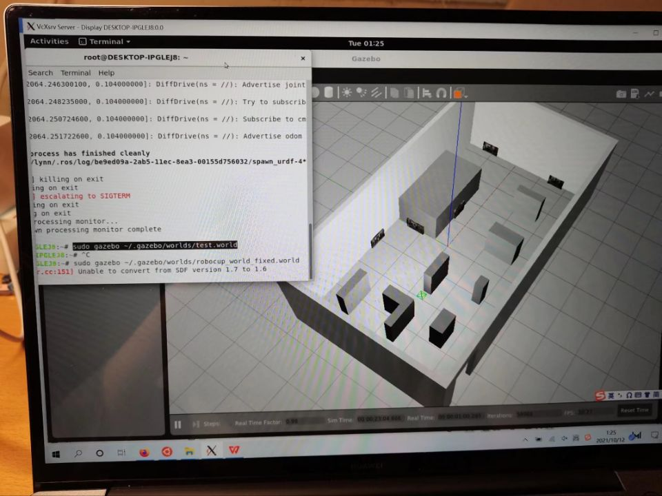

# 2022 SEU RoboCup@Home校赛复赛
2022 Southeast Unversity RoboCup@Home

2022 东南大学RoboCup@Home校赛复赛

 

## 任务目标
&nbsp;&nbsp;&nbsp;&nbsp;&nbsp;&nbsp;&nbsp;&nbsp;在基于gazebo的半实物仿真环境实现机器人自主导航至五个贴有实景图片的地点，机器人使用摄像头自主拍照，对所拍摄的照片进行识别，输出结果。其中实景图片中包含人物和物体，程序需要正确识别人物名称、性别，识别物体名称，区分不属于给定数据集的人物和物体。

## 环境配置
ubuntu18.04

ROS melodic

turtlebot3

anaconda

fast-rcnn

百度人脸识别API

## 软件架构
&nbsp;&nbsp;&nbsp;&nbsp;&nbsp;&nbsp;&nbsp;&nbsp;**Robocup2022/start.sh:** 程序入口

&nbsp;&nbsp;&nbsp;&nbsp;&nbsp;&nbsp;&nbsp;&nbsp;**Robocup2022/move.py:** 从指定路径载入实景图片至gazebo

&nbsp;&nbsp;&nbsp;&nbsp;&nbsp;&nbsp;&nbsp;&nbsp;**Robocup2022/1.py:** 启动ROS launch:开启gazebo环境，载入机器人；启动机器人导航程序

&nbsp;&nbsp;&nbsp;&nbsp;&nbsp;&nbsp;&nbsp;&nbsp;**Robocup2022/light.py:** 对拍摄到的图片进行亮度修正

&nbsp;&nbsp;&nbsp;&nbsp;&nbsp;&nbsp;&nbsp;&nbsp;**Robocup2022/version4.py:** 使用百度人脸识别API进行人脸识别

&nbsp;&nbsp;&nbsp;&nbsp;&nbsp;&nbsp;&nbsp;&nbsp;**faster-rcnn-pytorch-master/predict.py:(开源未给出)** 使用faster-rcnn实现物体识别 

&nbsp;&nbsp;&nbsp;&nbsp;&nbsp;&nbsp;&nbsp;&nbsp;**home/launch/step1.launch:** 开启gazebo环境，载入机器人

&nbsp;&nbsp;&nbsp;&nbsp;&nbsp;&nbsp;&nbsp;&nbsp;**home/launch/step2.launch:** 启动机器人导航程序

&nbsp;&nbsp;&nbsp;&nbsp;&nbsp;&nbsp;&nbsp;&nbsp;**home/src/test.py:** 机器人导航

&nbsp;&nbsp;&nbsp;&nbsp;&nbsp;&nbsp;&nbsp;&nbsp;**home/models:** gazebo模型

&nbsp;&nbsp;&nbsp;&nbsp;&nbsp;&nbsp;&nbsp;&nbsp;**home/worlds:** gazebo世界

&nbsp;&nbsp;&nbsp;&nbsp;&nbsp;&nbsp;&nbsp;&nbsp;**Robocup2022/Picture/Img:** 图片指定载入路径

&nbsp;&nbsp;&nbsp;&nbsp;&nbsp;&nbsp;&nbsp;&nbsp;**Robocup2022/Picture/shot:** 机器人拍摄图像保存路径

&nbsp;&nbsp;&nbsp;&nbsp;&nbsp;&nbsp;&nbsp;&nbsp;**Robocup2022/Picture/temp:** 调整亮度后图像保存路径

&nbsp;&nbsp;&nbsp;&nbsp;&nbsp;&nbsp;&nbsp;&nbsp;**Robocup2022/Picture/Facelib:** 人脸库载入路径

&nbsp;&nbsp;&nbsp;&nbsp;&nbsp;&nbsp;&nbsp;&nbsp;**Robocup2022/Picture/face:** 人脸识别后图像保存路径

## 实现流程
- 从指定路径载入实景图片至gazebo
- 启动ROS launch
 
&nbsp;&nbsp;&nbsp;&nbsp;&nbsp;&nbsp;&nbsp;&nbsp;开启gazebo环境，载入机器人
 
&nbsp;&nbsp;&nbsp;&nbsp;&nbsp;&nbsp;&nbsp;&nbsp;开启机器人导航程序
- 对拍摄到的图片进行亮度修正
- 使用百度人脸识别API进行人脸识别
- 使用faster-rcnn进行物体识别

## 改进意见
#### 启动ROS launch
&nbsp;&nbsp;&nbsp;&nbsp;&nbsp;&nbsp;&nbsp;&nbsp;原先ROS launch启动写在python文件中，可以将其改到shell文件中
#### 亮度修正
&nbsp;&nbsp;&nbsp;&nbsp;&nbsp;&nbsp;&nbsp;&nbsp;原先机器人拍摄的照片需要进行亮度修正之后进行识别，可以在机器人拍摄时进行补光，删去亮度修正。亮度修正步骤会影响识别精度。
#### 物体识别网络
&nbsp;&nbsp;&nbsp;&nbsp;&nbsp;&nbsp;&nbsp;&nbsp;原先选择faster-rcnn实现物体识别，可以改用百度物体识别模型/yolo实现物体识别

## 权益
&nbsp;&nbsp;&nbsp;&nbsp;&nbsp;&nbsp;&nbsp;&nbsp;本项目对于比赛仅供参考学习，<mark>**将其用于比赛出现任何问题，本项目概不负责**</mark>
 
&nbsp;&nbsp;&nbsp;&nbsp;&nbsp;&nbsp;&nbsp;&nbsp;本项目遵循MIT开源协议